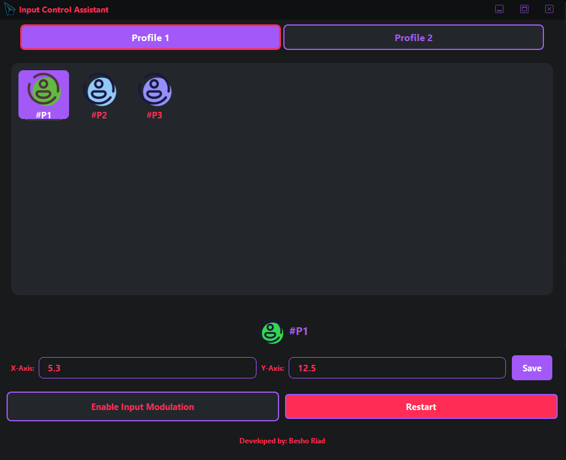

# Input Control Assistant

A general-purpose system tool for optimizing input control and workflow efficiency. This application allows you to create and manage customizable input modulation profiles with support for multiple profile groups.



## Features

- **Profile Management**: Create and organize input modulation profiles into two configurable groups (Group A and Group B)
- **Customizable Settings**: Adjust X and Y compensation values for each profile
- **Global Hotkey Support**: Toggle input modulation on/off using F8 key globally
- **System Tray Integration**: Minimize to system tray and control from tray menu
- **Persistent Storage**: All profile settings are automatically saved to database
- **Multi-threaded Architecture**: Non-blocking modulation loop with safe threading

## Installation

### Requirements
- Python 3.8+
- PySide6
- pynput
- psutil

### Setup

1. Clone or download this repository
2. Install dependencies:
```bash
pip install PySide6 pynput psutil
```

3. Run the application:
```bash
python main.py
```

## Usage

### Creating Profiles

1. Select a profile from either **Profiles A** or **Profiles B** tab
2. Adjust the X-Axis and Y-Axis values to your desired modulation parameters
3. Click **Save** to store the settings

### Enabling Input Modulation

- Click **Enable Input Modulation** button, or
- Press **F8** key globally to toggle modulation on/off
- When enabled, the application will apply the selected profile's settings during input

### Managing Multiple Profiles

- Switch between different profiles on-the-fly
- Each profile remembers its own X and Y values
- Organize profiles across two groups for better workflow management

## Configuration

### Profiles Structure

Profiles are stored in `data/profiles.json`:
```json
{
  "profiles": [
    {
      "name": "Profile 1",
      "group": "A",
      "x": 0.0,
      "y": 0.0,
      "icon": "icons/profile.png"
    }
  ]
}
```

### Database

Profile settings are persisted in `settings.db` using SQLite:
- Database automatically creates on first run
- Profile settings (name, x, y values) are stored in `profile_settings` table

## Architecture

### Core Components

- **InputControlAssistant**: Main UI window managing the application lifecycle
- **modulation_loop()**: Core threading loop that applies input modulation when active
- **Profile Management**: Database-backed persistence for all user settings

### Input Modulation

The modulation system applies compensating movements with:
- Configurable X and Y offsets per profile
- Natural jitter and randomization for organic feel
- Periodic rest intervals to prevent detection
- Multiple fallback methods for cross-platform compatibility

## Hotkeys

- **F8**: Toggle input modulation on/off globally

## Project Structure

```
├── main.py                 # Main application code
├── data/
│   ├── profiles.json      # Profile definitions
│   └── settings.db        # SQLite database (auto-created)
├── icons/
│   └── profile.png        # Default profile icon
├── logo.ico               # Application icon
└── README.md              # This file
```

## Settings Storage

All profile settings are automatically saved to the local database and persist across application restarts.

## Tips for Best Results

1. **Start Conservative**: Begin with low X and Y values and adjust based on your workflow
2. **Profile Organization**: Use Group A for frequently used profiles and Group B for less common ones
3. **Regular Breaks**: The modulation includes built-in rest periods for natural operation

## Troubleshooting

### Profiles Not Loading
- Verify `data/profiles.json` exists and is valid JSON
- Check that `settings.db` file is not corrupted (delete to reset)

### Modulation Not Working
- Ensure the application has focus or F8 is properly recognized
- Check system hotkey conflicts with other applications
- Verify left mouse button detection is working

### UI Scaling Issues
- The application should auto-scale with your system DPI
- Resize the window to adjust layout

## Development

### Adding New Profiles

Edit `data/profiles.json` and add new profile objects to the `profiles` array:
```json
{
  "name": "Your Profile",
  "group": "A",
  "x": 5.0,
  "y": 10.0,
  "icon": "icons/profile.png"
}
```

### Building Executable

To create a standalone executable using PyInstaller:
```bash
pip install pyinstaller
pyinstaller --onefile --windowed --icon=logo.ico main.py
```

## License

MIT License, Developed by Beshoy Riad.


**Note**: This tool requires appropriate permissions and should be used in accordance with applicable terms of service for any applications or systems where it's deployed.
